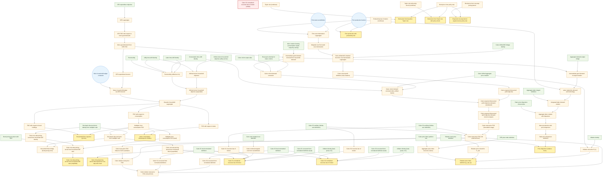

```mermaid
flowchart TD
E0["Period utility"]
E1["Utility time-shift identity"]
E2["Consumption time-shift identity"]
E3["Labor time-shift identity"]
E4["Period utility (shifted at t+k)"]
E5["Infinite-horizon household objective"]
E6["Infinite-horizon household objective (expanded)"]
E7["CES expenditure theorem"]
E8["CES price index definition"]
E9["Infinite-horizon household objective (utility anchor)"]
E10(("Micro household budget constraint"))
E11["Macro household budget via CES theorem"]
E12["Dynamic household Lagrangian"]
E13["FOC with respect to consumption"]
E14["FOC with respect to labor"]
E15["FOC with respect to bond holdings"]
E16["Multiplier from consumption FOC"]
E17["Stochastic discount factor identity from multiplier ratio"]
E18["Stochastic discount factor from multiplier ratio"]
E19["Household Euler equation (Q form)"]
E20["Bond pricing recursion with SDF"]
E21["Household Euler bridge (bond-pricing form)"]
E22["Labor-consumption intratemporal condition"]
E23["CES expenditure objective"]
E24["CES Lagrangian"]
E25["CES FOC with respect to micro-good demand"]
E26["Micro-good demand from CES FOC"]
E27(("Firm production function"))
E28(("Firm total cost definition"))
E29["Firm cost minimization Lagrangian"]
E30["Marginal cost from static cost minimization"]
E31["Micro market clearing (consumption equals output by variety)"]
E32["Intermediate-good demand mirrored from household demand"]
E33["Calvo price-index partition rule"]
E34["Aggregate price index recursion (Calvo)"]
E35["Calvo one-step pricing kernel from household SDF identity"]
E36["Multiplier from consumption FOC (lead)"]
E37["Calvo one-step pricing kernel from household SDF ratio"]
E38["Calvo one-step pricing kernel from household SDF ratio (simplified)"]
E39["Calvo one-step pricing kernel from household block (expanded)"]
E40["Calvo forward pricing kernel telescoped from one-step ratio chain"]
E41["Calvo shifted MC linkage identity"]
E42["Calvo shifted MC inherited from firm cost minimization Lagrangian"]
E43["Calvo cohort-output alias"]
E44["Reset-price identity for Calvo cohorts"]
E45["Calvo shifted aggregate price notation"]
E46["Calvo cohort demand constraint"]
E47["Calvo cohort demand constraint (time-shifted inputs)"]
E48["Calvo cohort profit definition (t+k|t notation)"]
E49["Calvo expected discounted profit objective"]
E50["Calvo expected discounted profit objective (demand-substituted)"]
E51["Calvo expected discounted profit objective (forward-kernel compact)"]
E52["Calvo S2 auxiliary (infinite-sum definition)"]
E53["Calvo S1 auxiliary (infinite-sum definition)"]
E54["Calvo S2 recursive law of motion"]
E55["Calvo S1 recursive law of motion"]
E56["Calvo reset-price FOC (formulation stage)"]
E57["Calvo reset-price FOC (H4 collected form)"]
E58["Calvo reset-price FOC linked to S1/S2 auxiliaries"]
E59["Relative reset price definition"]
E60["Relative price solved for P_star"]
E61["Calvo relative reset-price FOC"]
E62["Calvo relative reset-price FOC (closed form)"]
E63["Inflation identity"]
E64["Calvo real marginal cost definition"]
E65["Calvo nominal marginal cost from real definition"]
E66["Inflation solved for P(-1)"]
E67["Calvo S1 level-normalized definition"]
E68["Calvo S2 level-normalized definition"]
E69["Calvo S1 recovered from normalized definition"]
E70["Calvo S2 recovered from normalized definition"]
E71["Calvo S1 recovered from normalized definition (lead)"]
E72["Calvo S2 recovered from normalized definition (lead)"]
E73["Inflation identity (lead, power, S2)"]
E74["Inflation identity (lead, power, S2-)"]
E75["Calvo S1 normalized recursive law of motion"]
E76["Calvo S1 normalized recursive law of motion (reified)"]
E77["Calvo S2 normalized recursive law of motion"]
E78["Relative price index definition (p_star, pi)"]
E79["Aggregate demand-output bridge"]
E80["Intermediate-good demand in output notation"]
E81["Aggregate labor integral definition"]
E82["Static price dispersion closure alias"]
E83["Labor implied by demand and technology"]
E84["Integrated labor demand relation"]
E85["Aggregate labor relation with dispersion"]
E86["Macro production with price dispersion"]
E87["Static price dispersion definition"]
E88["Price dispersion (relative form)"]
E89["Productivity law of motion (nonlinear)"]
E90["Firm production with productivity law"]
E91["Taylor rule (nonlinear)"]
E92["Taylor rule with policy shock (nonlinear)"]
E93["Bond price from one-step pricing kernel"]
E94["Bond price from policy rate"]
E95["Bond price from baseline Taylor rule"]
E96["Bond price from Taylor rule with policy shock"]
E97["Expected one-step kernel equals inverse policy rate"]
E0 --> E4
E1 --> E4
E1 --> E5
E10 --> E11
E11 --> E12
E12 --> E13
E12 --> E14
E12 --> E15
E13 --> E16
E14 --> E22
E15 --> E19
E16 --> E18
E16 --> E19
E16 --> E22
E16 --> E36
E17 --> E18
E17 --> E35
E18 --> E21
E18 --> E39
E2 --> E4
E2 --> E47
E20 --> E21
E23 --> E24
E24 --> E25
E25 --> E26
E26 --> E32
E26 --> E7
E27 --> E29
E27 --> E83
E27 --> E90
E28 --> E29
E29 --> E30
E3 --> E4
E30 --> E42
E31 --> E32
E32 --> E46
E32 --> E80
E33 --> E34
E34 --> E78
E35 --> E37
E36 --> E37
E37 --> E38
E39 --> E40
E39 --> E75
E39 --> E77
E4 --> E6
E41 --> E42
E42 --> E48
E43 --> E46
E44 --> E46
E45 --> E47
E45 --> E66
E46 --> E47
E47 --> E50
E48 --> E49
E49 --> E50
E5 --> E6
E50 --> E51
E51 --> E56
E52 --> E54
E52 --> E57
E53 --> E55
E53 --> E57
E54 --> E77
E55 --> E75
E56 --> E57
E57 --> E58
E58 --> E61
E59 --> E60
E59 --> E61
E59 --> E88
E6 --> E12
E60 --> E78
E61 --> E62
E62 --> E57
E63 --> E66
E64 --> E65
E65 --> E75
E66 --> E78
E67 --> E69
E67 --> E75
E68 --> E70
E68 --> E77
E69 --> E62
E7 --> E11
E70 --> E62
E71 --> E75
E72 --> E77
E73 --> E75
E74 --> E77
E79 --> E80
E8 --> E34
E80 --> E83
E81 --> E84
E82 --> E85
E83 --> E84
E84 --> E85
E85 --> E86
E86 --> E87
E87 --> E88
E89 --> E90
E9 --> E5
E91 --> E95
E92 --> E96
E93 --> E97
E94 --> E95
E94 --> E96
E94 --> E97
classDef eqAtom fill:#E8F4FD,stroke:#0366D6,stroke-width:1px,color:#0B2540
classDef eqDefinition fill:#EEF7E8,stroke:#2E7D32,stroke-width:1px,color:#16331A
classDef eqDerived fill:#FFF7E6,stroke:#B26A00,stroke-width:1px,color:#4A2A00
classDef eqSink fill:#FFF3B0,stroke:#A56A00,stroke-width:2px,color:#4A2A00
classDef eqOrphan fill:#FFECEC,stroke:#C62828,stroke-width:2px,color:#5A1111
classDef opTransform fill:#EDE7F6,stroke:#5E35B1,stroke-width:1px,color:#2F1B5A
classDef opMicro fill:#ECEFF1,stroke:#546E7A,stroke-width:1px,color:#1F2B33
class E10,E27,E28 eqAtom
class E0,E1,E17,E2,E20,E23,E3,E31,E33,E41,E43,E44,E45,E52,E53,E59,E63,E64,E67,E68,E71,E72,E73,E74,E79,E8,E81,E82,E9 eqDefinition
class E11,E12,E13,E14,E15,E16,E18,E21,E24,E25,E26,E29,E30,E32,E34,E35,E36,E37,E39,E4,E42,E46,E47,E48,E49,E5,E50,E51,E54,E55,E56,E57,E58,E6,E60,E61,E62,E65,E66,E69,E7,E70,E80,E83,E84,E85,E86,E87,E89,E91,E92,E93,E94 eqDerived
class E76 eqOrphan
class E19,E22,E38,E40,E75,E77,E78,E88,E90,E95,E96,E97 eqSink
```
