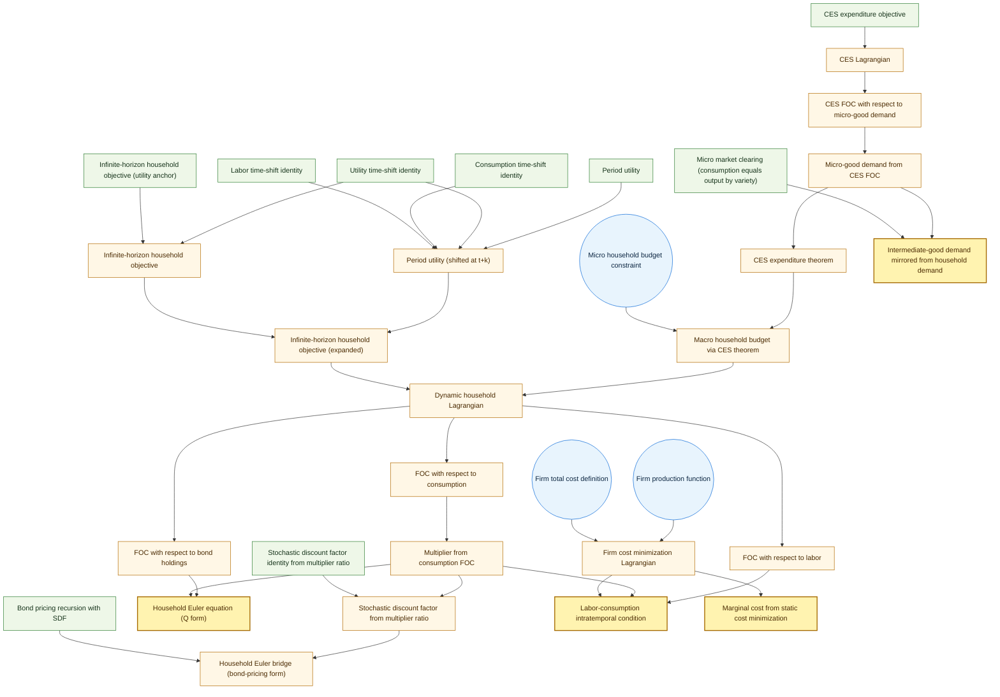

# Audit Trail: NKM Household-Firm Micro Link (Strict)
**Generated by:** Generative DSGE Kernel (V6)
**Date:** 2026-02-20

## Table of Contents
- [Household: Dynamic Problem](#household-dynamic-problem)
- [Household: Micro Demand](#household-micro-demand)
- [Firm: Cost Minimization](#firm-cost-minimization)
- [Firm: Demand Bridge](#firm-demand-bridge)

## Household: Dynamic Problem

Lift a linear operator to both sides of an equation.
_Summary: 1 atoms, 11 definitions, 63 derived._

### Narrative: Objective and constraints

```math
\text{We state the objective and constraints to set up the optimization problem.}
```

### Objective

```math
\text{Infinite-horizon household objective}
```

### Objective metadata

```math
\text{Expectation anchor: } t\\ \text{Index ranges: } k \in 0,\infty
```

### Constraints

```math
\text{Household budget}
```

### Choices

```math
\text{Choices: } C_t, N_t, B_t
```

### Narrative: Lagrangian

```math
\text{We construct the Lagrangian by combining the objective with the constraints and multipliers.}
```

### Period utility

```math
U_t = \frac{{C_t}^{(1 - \sigma)}}{(1 - \sigma)} - \frac{{N_t}^{(1 + \phi)}}{(1 + \phi)}
```
Where:
- $C_t$ denotes aggregate consumption
- $N_t$ denotes labor
- $U_t$ denotes period utility
- $\phi$ denotes inverse Frisch elasticity
- $\sigma$ denotes inverse IES

### Utility time-shift identity

```math
U_t = U_{t+k}
```
Where:
- $U_t$ denotes period utility
- $U_{t+k}$ denotes future period utility

### Consumption time-shift identity

```math
C_t = C_{t+k}
```
Where:
- $C_t$ denotes aggregate consumption

### Labor time-shift identity

```math
N_t = N_{t+k}
```
Where:
- $N_t$ denotes labor

### Period utility (shifted at t+k)

```math
U_{t+k} = \frac{{C_{t+k}}^{(1 - \sigma)}}{(1 - \sigma)} - \frac{{N_{t+k}}^{(1 + \phi)}}{(1 + \phi)}
```
Where:
- $C_{t+k}$ denotes aggregate consumption at t+k
- $N_{t+k}$ denotes labor at t+k
- $U_{t+k}$ denotes future period utility
- $\phi$ denotes inverse Frisch elasticity
- $\sigma$ denotes inverse IES

Proof:


Start from the following equation.

```math
U_t = \frac{{C_t}^{(1 - \sigma)}}{(1 - \sigma)} - \frac{{N_t}^{(1 + \phi)}}{(1 + \phi)}
```

Substitute $C_t$ with $C_{t+k}$.

```math
\Rightarrow U_t = \frac{{C_{t+k}}^{(1 - \sigma)}}{(1 - \sigma)} - \frac{{N_t}^{(1 + \phi)}}{(1 + \phi)}
```

Substitute $N_t$ with $N_{t+k}$.

```math
\Rightarrow U_t = \frac{{C_{t+k}}^{(1 - \sigma)}}{(1 - \sigma)} - \frac{{N_{t+k}}^{(1 + \phi)}}{(1 + \phi)}
```

Substitute $U_t$ with $U_{t+k}$.

```math
\Rightarrow U_{t+k} = \frac{{C_{t+k}}^{(1 - \sigma)}}{(1 - \sigma)} - \frac{{N_{t+k}}^{(1 + \phi)}}{(1 + \phi)} \quad \square
```

### Infinite-horizon household objective

```math
\mathcal{U}_t = \mathbb{E}_{t}[\sum_{k=0}^{\infty} (\beta^{k} \cdot U_{t+k})]
```
Where:
- $U_{t+k}$ denotes future period utility
- $\beta$ denotes discount factor
- $\mathcal{U}_t$ denotes lifetime utility objective

Proof:


Start from the following equation.

```math
\mathcal{U}_t = \mathbb{E}_{t}[\sum_{k=0}^{\infty} (\beta^{k} \cdot U_t)]
```

```math
\Rightarrow \mathcal{U}_t = \mathbb{E}_{t}[\sum_{k=0}^{\infty} (\beta^{k} \cdot U_{t+k})] \quad \square
```

### Infinite-horizon household objective (expanded)

```math
\mathcal{U}_t = \mathbb{E}_{t}[\sum_{k=0}^{\infty} (\beta^{k} \cdot (\frac{{C_{t+k}}^{(1 - \sigma)}}{(1 - \sigma)} - \frac{{N_{t+k}}^{(1 + \phi)}}{(1 + \phi)}))]
```
Where:
- $C_{t+k}$ denotes aggregate consumption at t+k
- $N_{t+k}$ denotes labor at t+k
- $\beta$ denotes discount factor
- $\mathcal{U}_t$ denotes lifetime utility objective
- $\phi$ denotes inverse Frisch elasticity
- $\sigma$ denotes inverse IES

Proof:


Start from the following equation.

```math
\mathcal{U}_t = \mathbb{E}_{t}[\sum_{k=0}^{\infty} (\beta^{k} \cdot U_{t+k})]
```

Substitute Period utility (shifted at t+k) into Infinite-horizon household objective.

```math
\Rightarrow \mathcal{U}_t = \mathbb{E}_{t}[\sum_{k=0}^{\infty} (\beta^{k} \cdot (\frac{{C_{t+k}}^{(1 - \sigma)}}{(1 - \sigma)} - \frac{{N_{t+k}}^{(1 + \phi)}}{(1 + \phi)}))] \quad \square
```

### CES expenditure theorem

```math
\int_{0}^{1} (p_t(i) \cdot c_t(i)) \, di = C_t \cdot P_t
```
Where:
- $C_t$ denotes aggregate consumption
- $P_t$ denotes aggregate price index
- $c_t(i)$ denotes consumption of variety i
- $p_t(i)$ denotes price of variety i

Proof:


Start from the following equation.

```math
p_t(i) \cdot c_t(i) = p_t(i) \cdot c_t(i)
```

Lift the integral operator to both sides.

```math
\Rightarrow \int_{0}^{1} (p_t(i) \cdot c_t(i)) \, di = \int_{0}^{1} (p_t(i) \cdot c_t(i)) \, di
```

Substitute $c_t(i)$ with $((C_t \cdot {p_t(i)}^{-\epsilon}) \cdot {P_t}^{\epsilon})$ on the rhs side only.

```math
\Rightarrow \int_{0}^{1} (p_t(i) \cdot c_t(i)) \, di = \int_{0}^{1} (p_t(i) \cdot ((C_t \cdot {p_t(i)}^{-\epsilon}) \cdot {P_t}^{\epsilon})) \, di
```

Substitute the definition of $\int_{0}^{1} {c_t(i)}^{\frac{(\epsilon - 1)}{\epsilon}} \, di$ into the equation.

```math
\Rightarrow \int_{0}^{1} (p_t(i) \cdot c_t(i)) \, di = \int_{0}^{1} (({p_t(i)}^{(1 - \epsilon)} \cdot C_t) \cdot {P_t}^{\epsilon}) \, di
```

Apply linearity of the integral operator.

```math
\Rightarrow \int_{0}^{1} (p_t(i) \cdot c_t(i)) \, di = (C_t \cdot {P_t}^{\epsilon}) \cdot \int_{0}^{1} {p_t(i)}^{(1 - \epsilon)} \, di
```

Substitute the definition of $\int_{0}^{1} {p_t(i)}^{(1 - \epsilon)} \, di$ into the equation.

```math
\Rightarrow \int_{0}^{1} (p_t(i) \cdot c_t(i)) \, di = C_t \cdot P_t \quad \square
```

### Infinite-horizon household objective (utility anchor)

```math
\mathcal{U}_t = \mathbb{E}_{t}[\sum_{k=0}^{\infty} (\beta^{k} \cdot U_t)]
```
Where:
- $U_t$ denotes period utility
- $\beta$ denotes discount factor
- $\mathcal{U}_t$ denotes lifetime utility objective

### Micro household budget constraint

```math
\int_{0}^{1} (p_t(i) \cdot c_t(i)) \, di + (Q_t \cdot B_{t+1}) = ((W_t \cdot N_t) + B_t) + \Pi_t
```
Where:
- $B_t$ denotes one-period nominal bonds
- $N_t$ denotes labor
- $Q_t$ denotes one-period bond price
- $W_t$ denotes nominal wage
- $\Pi_t$ denotes profits rebated to households
- $c_t(i)$ denotes consumption of variety i
- $p_t(i)$ denotes price of variety i

### Macro household budget via CES theorem

```math
(C_t \cdot P_t) + (Q_t \cdot B_{t+1}) = ((W_t \cdot N_t) + B_t) + \Pi_t
```
Where:
- $B_t$ denotes one-period nominal bonds
- $C_t$ denotes aggregate consumption
- $N_t$ denotes labor
- $P_t$ denotes aggregate price index
- $Q_t$ denotes one-period bond price
- $W_t$ denotes nominal wage
- $\Pi_t$ denotes profits rebated to households

Proof:


Start from the following equation.

```math
\int_{0}^{1} (p_t(i) \cdot c_t(i)) \, di + (Q_t \cdot B_{t+1}) = ((W_t \cdot N_t) + B_t) + \Pi_t
```

Substitute CES expenditure theorem into Micro household budget constraint.

```math
\Rightarrow (C_t \cdot P_t) + (Q_t \cdot B_{t+1}) = ((W_t \cdot N_t) + B_t) + \Pi_t \quad \square
```

### Dynamic household Lagrangian

```math
\mathcal{L}_t = \mathbb{E}_{t}[\sum_{k=0}^{\infty} (\beta^{k} \cdot (\frac{{C_{t+k}}^{(1 - \sigma)}}{(1 - \sigma)} - \frac{{N_{t+k}}^{(1 + \phi)}}{(1 + \phi)}))] + (\Lambda_t \cdot (((C_t \cdot P_t) + (Q_t \cdot B_{t+1})) - (((W_t \cdot N_t) + B_t) + \Pi_t)))
```
Where:
- $B_t$ denotes one-period nominal bonds
- $C_{t+k}$ denotes aggregate consumption at t+k
- $N_{t+k}$ denotes labor at t+k
- $P_t$ denotes aggregate price index
- $Q_t$ denotes one-period bond price
- $W_t$ denotes nominal wage
- $\Lambda_t$ denotes budget multiplier
- $\Pi_t$ denotes profits rebated to households
- $\beta$ denotes discount factor
- $\phi$ denotes inverse Frisch elasticity
- $\sigma$ denotes inverse IES

### FOC with respect to consumption

```math
{C_t}^{-\sigma} + (\Lambda_t \cdot P_t) = 0
```
Where:
- $C_t$ denotes aggregate consumption
- $P_t$ denotes aggregate price index
- $\Lambda_t$ denotes budget multiplier
- $\sigma$ denotes inverse IES

Proof:


Start from the following equation.

```math
\frac{\partial \mathcal{L}}{\partial C_t} = (0 + (1 \cdot ((1 \cdot {C_t}^{((1 - \sigma) - 1)}) + (\Lambda_t \cdot P_t))))
```

Differentiate the Lagrangian.

```math
\Rightarrow (0 + (1 \cdot ((1 \cdot {C_t}^{((1 - \sigma) - 1)}) + (\Lambda_t \cdot P_t)))) = 0
```

Select the local-time indexed variation term for $C_t$.

```math
\Rightarrow 0 + (1 \cdot ((1 \cdot {C_t}^{((1 - \sigma) - 1)}) + (\Lambda_t \cdot P_t))) = 0
```

Simplify the expression.

```math
\Rightarrow {C_t}^{-\sigma} + (\Lambda_t \cdot P_t) = 0 \quad \square
```

### FOC with respect to labor

```math
-{N_t}^{\phi} - (\Lambda_t \cdot W_t) = 0
```
Where:
- $N_t$ denotes labor
- $W_t$ denotes nominal wage
- $\Lambda_t$ denotes budget multiplier
- $\phi$ denotes inverse Frisch elasticity

Proof:


Start from the following equation.

```math
\frac{\partial \mathcal{L}}{\partial N_t} = (0 + (1 \cdot ((1 \cdot -{N_t}^{((1 + \phi) - 1)}) + (\Lambda_t \cdot -W_t))))
```

Differentiate the Lagrangian.

```math
\Rightarrow (0 + (1 \cdot ((1 \cdot -{N_t}^{((1 + \phi) - 1)}) + (\Lambda_t \cdot -W_t)))) = 0
```

Select the local-time indexed variation term for $N_t$.

```math
\Rightarrow 0 + (1 \cdot ((1 \cdot -{N_t}^{((1 + \phi) - 1)}) + (\Lambda_t \cdot -W_t))) = 0
```

Simplify the expression.

```math
\Rightarrow -{N_t}^{\phi} - (\Lambda_t \cdot W_t) = 0 \quad \square
```

### FOC with respect to bond holdings

```math
(\beta \cdot \mathbb{E}_{t}[(\Lambda_{t+1} \cdot Q_{t+1})]) - \Lambda_t = 0
```
Where:
- $Q_t$ denotes one-period bond price
- $\Lambda_t$ denotes budget multiplier
- $\beta$ denotes discount factor

Proof:


Start from the following equation.

```math
\frac{\partial \mathcal{L}}{\partial B_t} = ((0 + (1 \cdot (0 + -\Lambda_t))) + ({\beta}^{1} \cdot \mathbb{E}_{t}[(\Lambda_t \cdot Q_t)_{t+1}]))
```

Differentiate the Lagrangian.

```math
\Rightarrow ((0 + (1 \cdot (0 + -\Lambda_t))) + ({\beta}^{1} \cdot \mathbb{E}_{t}[(\Lambda_t \cdot Q_t)_{t+1}])) = 0
```

Cancel common multiplicative factors in a rational expression.

```math
\Rightarrow (0 + (1 \cdot (0 + -\Lambda_t))) + ({\beta}^{1} \cdot \mathbb{E}_{t}[(\Lambda_t \cdot Q_t)_{t+1}]) = 0
```

Simplify the expression.

```math
\Rightarrow (\beta \cdot \mathbb{E}_{t}[(\Lambda_{t+1} \cdot Q_{t+1})]) - \Lambda_t = 0 \quad \square
```

### Multiplier from consumption FOC

```math
\Lambda_t = -\frac{{C_t}^{-\sigma}}{P_t}
```
Where:
- $C_t$ denotes aggregate consumption
- $P_t$ denotes aggregate price index
- $\Lambda_t$ denotes budget multiplier
- $\sigma$ denotes inverse IES

Proof:


Start from the following equation.

```math
{C_t}^{-\sigma} + (\Lambda_t \cdot P_t) = 0
```

solve for $\Lambda_t$.

```math
\Rightarrow \Lambda_t = \frac{-{C_t}^{-\sigma}}{P_t}
```

Normalize multiplicative sign factors.

```math
\Rightarrow \Lambda_t = -\frac{{C_t}^{-\sigma}}{P_t} \quad \square
```

### Stochastic discount factor identity from multiplier ratio

```math
M_{t,t+1} = \beta \cdot \frac{\Lambda_{t+1}}{\Lambda_t}
```
Where:
- $M_{t,t+1}$ denotes stochastic discount factor
- $\Lambda_t$ denotes budget multiplier
- $\beta$ denotes discount factor

### Stochastic discount factor from multiplier ratio

```math
M_{t,t+1} = (((\beta \cdot {C_{t+1}}^{-\sigma}) \cdot {P_{t+1}}^{-1}) \cdot {C_t}^{\sigma}) \cdot P_t
```
Where:
- $C_t$ denotes aggregate consumption
- $M_{t,t+1}$ denotes stochastic discount factor
- $P_t$ denotes aggregate price index
- $\beta$ denotes discount factor
- $\sigma$ denotes inverse IES

Proof:


Start from the following equation.

```math
M_{t,t+1} = \beta \cdot \frac{\Lambda_{t+1}}{\Lambda_t}
```

Substitute $\Lambda_t$ with $-\frac{{C_t}^{-\sigma}}{P_t}$.

```math
\Rightarrow M_{t,t+1} = \beta \cdot \frac{-\frac{{C_t}^{-\sigma}}{P_t}_{t+1}}{-\frac{{C_t}^{-\sigma}}{P_t}}
```

Cancel common multiplicative factors in a rational expression.

```math
\Rightarrow M_{t,t+1} = \beta \cdot \frac{\frac{{C_{t+1}}^{-\sigma}}{P_{t+1}}}{({C_t}^{-\sigma} \cdot {P_t}^{-1})}
```

Simplify the expression.

```math
\Rightarrow M_{t,t+1} = (((\beta \cdot {C_{t+1}}^{-\sigma}) \cdot {P_{t+1}}^{-1}) \cdot {C_t}^{\sigma}) \cdot P_t \quad \square
```

### Household Euler equation (Q form)

```math
\frac{{C_t}^{-\sigma}}{P_t} - (\beta \cdot \mathbb{E}_{t}[(({C_{t+1}}^{-\sigma} \cdot {P_{t+1}}^{-1}) \cdot Q_{t+1})]) = 0
```
Where:
- $C_t$ denotes aggregate consumption
- $P_t$ denotes aggregate price index
- $Q_t$ denotes one-period bond price
- $\beta$ denotes discount factor
- $\sigma$ denotes inverse IES

Proof:


Start from the following equation.

```math
(\beta \cdot \mathbb{E}_{t}[(\Lambda_{t+1} \cdot Q_{t+1})]) - \Lambda_t = 0
```

Substitute $\Lambda_t$ with $-\frac{{C_t}^{-\sigma}}{P_t}$.

```math
\Rightarrow (\beta \cdot \mathbb{E}_{t}[(-\frac{{C_t}^{-\sigma}}{P_t}_{t+1} \cdot Q_{t+1})]) - -\frac{{C_t}^{-\sigma}}{P_t} = 0
```

Normalize scalar sign factors in expectation/summation operators.

```math
\Rightarrow (\beta \cdot -\mathbb{E}_{t}[(({C_{t+1}}^{-\sigma} \cdot {P_{t+1}}^{-1}) \cdot Q_{t+1})]) - -\frac{{C_t}^{-\sigma}}{P_t} = 0
```

Simplify the expression.

```math
\Rightarrow \frac{{C_t}^{-\sigma}}{P_t} - (\beta \cdot \mathbb{E}_{t}[(({C_{t+1}}^{-\sigma} \cdot {P_{t+1}}^{-1}) \cdot Q_{t+1})]) = 0 \quad \square
```

### Bond pricing recursion with SDF

```math
Q_t = \mathbb{E}_{t}[M_{t,t+1}]
```
Where:
- $M_{t,t+1}$ denotes stochastic discount factor
- $Q_t$ denotes one-period bond price

### Household Euler bridge (bond-pricing form)

```math
Q_t = \mathbb{E}_{t}[((((\beta \cdot {C_{t+1}}^{-\sigma}) \cdot {P_{t+1}}^{-1}) \cdot {C_t}^{\sigma}) \cdot P_t)]
```
Where:
- $C_t$ denotes aggregate consumption
- $P_t$ denotes aggregate price index
- $Q_t$ denotes one-period bond price
- $\beta$ denotes discount factor
- $\sigma$ denotes inverse IES

Proof:


Start from the following equation.

```math
Q_t = \mathbb{E}_{t}[M_{t,t+1}]
```

Substitute Stochastic discount factor from multiplier ratio into Bond pricing recursion with SDF.

```math
\Rightarrow Q_t = \mathbb{E}_{t}[((((\beta \cdot {C_{t+1}}^{-\sigma}) \cdot {P_{t+1}}^{-1}) \cdot {C_t}^{\sigma}) \cdot P_t)] \quad \square
```

### Labor-consumption intratemporal condition

```math
W_t = \frac{{N_t}^{\phi}}{({C_t}^{-\sigma} \cdot {P_t}^{-1})}
```
Where:
- $C_t$ denotes aggregate consumption
- $N_t$ denotes labor
- $P_t$ denotes aggregate price index
- $W_t$ denotes nominal wage
- $\phi$ denotes inverse Frisch elasticity
- $\sigma$ denotes inverse IES

Proof:


Start from the following equation.

```math
-{N_t}^{\phi} - (\Lambda_t \cdot W_t) = 0
```

Substitute $\Lambda_t$ with $-\frac{{C_t}^{-\sigma}}{P_t}$.

```math
\Rightarrow -{N_t}^{\phi} - (-\frac{{C_t}^{-\sigma}}{P_t} \cdot W_t) = 0
```

Simplify the expression.

```math
\Rightarrow (({C_t}^{-\sigma} \cdot {P_t}^{-1}) \cdot W_t) - {N_t}^{\phi} = 0
```

solve for $W_t$.

```math
\Rightarrow W_t = \frac{{N_t}^{\phi}}{({C_t}^{-\sigma} \cdot {P_t}^{-1})} \quad \square
```

## Household: Micro Demand

Build a Lagrangian equation from an OptimizationProblem.
_Summary: 6 definitions, 17 derived._

### Narrative: Objective and constraints

```math
\text{We state the objective and constraints to set up the optimization problem.}
```

### Objective

```math
\text{CES expenditure minimization}
```

### Constraints

```math
\text{CES aggregator}
```

### Constraint: CES aggregator (technology, t)

```math
C_t = {\int_{0}^{1} {c_t(i)}^{\frac{(\epsilon - 1)}{\epsilon}} \, di}^{\frac{\epsilon}{(\epsilon - 1)}}
```

### Choices

```math
\text{Choices: } c_t(i)
```

### Constraint multipliers

```math
CES aggregator: \Lambda_t^{ces}
```

### Narrative: Lagrangian

```math
\text{We construct the Lagrangian by combining the objective with the constraints and multipliers.}
```

### CES expenditure objective

```math
\mathcal{J}_t = \int_{0}^{1} (p_t(i) \cdot c_t(i)) \, di
```
Where:
- $\mathcal{J}_t$ denotes CES expenditure objective
- $c_t(i)$ denotes consumption of variety i
- $p_t(i)$ denotes price of variety i

### CES Lagrangian

```math
\mathcal{L}_t^{ces} = \int_{0}^{1} (p_t(i) \cdot c_t(i)) \, di + (\Lambda_t^{ces} \cdot (C_t - {\int_{0}^{1} {c_t(i)}^{\frac{(\epsilon - 1)}{\epsilon}} \, di}^{\frac{\epsilon}{(\epsilon - 1)}}))
```
Where:
- $C_t$ denotes aggregate consumption
- $\Lambda_t^{ces}$ denotes CES multiplier
- $\epsilon$ denotes elasticity of substitution
- $\mathcal{L}_t^{ces}$ denotes CES Lagrangian
- $c_t(i)$ denotes consumption of variety i
- $p_t(i)$ denotes price of variety i

### CES FOC with respect to micro-good demand

```math
p_t(i) = (\Lambda_t^{ces} \cdot {\int_{0}^{1} {c_t(i)}^{\frac{(\epsilon - 1)}{\epsilon}} \, di}^{\frac{1}{(\epsilon - 1)}}) \cdot {c_t(i)}^{\frac{-1}{\epsilon}}
```
Where:
- $\Lambda_t^{ces}$ denotes CES multiplier
- $\epsilon$ denotes elasticity of substitution
- $c_t(i)$ denotes consumption of variety i
- $p_t(i)$ denotes price of variety i

Proof:


Start from the following equation.

```math
\mathcal{L}_t^{ces} = \int_{0}^{1} (p_t(i) \cdot c_t(i)) \, di + (\Lambda_t^{ces} \cdot (C_t - {\int_{0}^{1} {c_t(i)}^{\frac{(\epsilon - 1)}{\epsilon}} \, di}^{\frac{\epsilon}{(\epsilon - 1)}}))
```

Take the formal derivative with respect to $c_t(i)$.

```math
\Rightarrow 0 = p_t(i) + (\Lambda_t^{ces} \cdot -((\frac{\epsilon}{(\epsilon - 1)} \cdot {\int_{0}^{1} {c_t(i)}^{\frac{(\epsilon - 1)}{\epsilon}} \, di}^{(\frac{\epsilon}{(\epsilon - 1)} - 1)}) \cdot (\frac{(\epsilon - 1)}{\epsilon} \cdot {c_t(i)}^{(\frac{(\epsilon - 1)}{\epsilon} - 1)})))
```

solve for $p_t(i)$.

```math
\Rightarrow p_t(i) = (\Lambda_t^{ces} \cdot {\int_{0}^{1} {c_t(i)}^{\frac{(\epsilon - 1)}{\epsilon}} \, di}^{\frac{1}{(\epsilon - 1)}}) \cdot {c_t(i)}^{\frac{-1}{\epsilon}} \quad \square
```

### Micro-good demand from CES FOC

```math
c_t(i) = (C_t \cdot {p_t(i)}^{-\epsilon}) \cdot {P_t}^{\epsilon}
```
Where:
- $C_t$ denotes aggregate consumption
- $P_t$ denotes aggregate price index
- $\epsilon$ denotes elasticity of substitution
- $c_t(i)$ denotes consumption of variety i
- $p_t(i)$ denotes price of variety i

Proof:


Start from the following equation.

```math
p_t(i) = (\Lambda_t^{ces} \cdot {\int_{0}^{1} {c_t(i)}^{\frac{(\epsilon - 1)}{\epsilon}} \, di}^{\frac{1}{(\epsilon - 1)}}) \cdot {c_t(i)}^{\frac{-1}{\epsilon}}
```

Solve monomial-power equation for $c_t(i)$.

```math
\Rightarrow c_t(i) = {\frac{p_t(i)}{(1 \cdot (\Lambda_t^{ces} \cdot {\int_{0}^{1} {c_t(i)}^{\frac{(\epsilon - 1)}{\epsilon}} \, di}^{\frac{1}{(\epsilon - 1)}}))}}^{\frac{1}{\frac{-1}{\epsilon}}}
```

Substitute $\Lambda_t^{ces}$ with $P_t$.

```math
\Rightarrow c_t(i) = {\frac{p_t(i)}{(1 \cdot (P_t \cdot {\int_{0}^{1} {c_t(i)}^{\frac{(\epsilon - 1)}{\epsilon}} \, di}^{\frac{1}{(\epsilon - 1)}}))}}^{\frac{1}{\frac{-1}{\epsilon}}}
```

Simplify the expression.

```math
\Rightarrow c_t(i) = ({p_t(i)}^{-\epsilon} \cdot {P_t}^{\epsilon}) \cdot {\int_{0}^{1} {c_t(i)}^{\frac{(\epsilon - 1)}{\epsilon}} \, di}^{({(\epsilon - 1)}^{-1} \cdot \epsilon)}
```

Normalize a common-exponent product into ratio-power form.

```math
\Rightarrow c_t(i) = ({\int_{0}^{1} {c_t(i)}^{\frac{(\epsilon - 1)}{\epsilon}} \, di}^{({(\epsilon - 1)}^{-1} \cdot \epsilon)} \cdot {p_t(i)}^{-\epsilon}) \cdot {P_t}^{\epsilon}
```

Substitute $\int_{0}^{1} {c_t(i)}^{\frac{(\epsilon - 1)}{\epsilon}} \, di$ with ${C_t}^{\frac{(\epsilon - 1)}{\epsilon}}$ on the rhs side only.

```math
\Rightarrow c_t(i) = ({{C_t}^{\frac{(\epsilon - 1)}{\epsilon}}}^{({(\epsilon - 1)}^{-1} \cdot \epsilon)} \cdot {p_t(i)}^{-\epsilon}) \cdot {P_t}^{\epsilon}
```

Simplify the expression.

```math
\Rightarrow c_t(i) = (C_t \cdot {p_t(i)}^{-\epsilon}) \cdot {P_t}^{\epsilon} \quad \square
```

## Firm: Cost Minimization

Build a Lagrangian equation from an OptimizationProblem.
_Summary: 2 atoms, 3 definitions, 9 derived._

### Narrative: Objective and constraints

```math
\text{We state the objective and constraints to set up the optimization problem.}
```

### Objective

```math
\text{Total cost}
```

### Constraints

```math
\text{Production constraint}
```

### Choices

```math
\text{Choices: } n_t(i)
```

### Narrative: Lagrangian

```math
\text{We construct the Lagrangian by combining the objective with the constraints and multipliers.}
```

### Firm production function

```math
y_t(i) = A_t \cdot n_t(i)
```

### Firm total cost definition

```math
TC_t(i) = ((1 - \tau) \cdot W_t) \cdot n_t(i)
```
Where:
- $W_t$ denotes nominal wage

### Firm cost minimization Lagrangian

```math
\mathcal{L}_t^{firm} = (((1 - \tau) \cdot W_t) \cdot n_t(i)) + (MC_t \cdot (y_t(i) - (A_t \cdot n_t(i))))
```
Where:
- $W_t$ denotes nominal wage

### Marginal cost from static cost minimization

```math
MC_t = \frac{((\tau - 1) \cdot W_t)}{-A_t}
```
Where:
- $W_t$ denotes nominal wage

Proof:


Start from the following equation.

```math
\frac{\partial \mathcal{L}}{\partial n_t(i)} = (((1 - \tau) \cdot W_t) + (MC_t \cdot -A_t))
```

Differentiate the Lagrangian.

```math
\Rightarrow (((1 - \tau) \cdot W_t) + (MC_t \cdot -A_t)) = 0
```

solve for $MC_t$.

```math
\Rightarrow MC_t = \frac{((\tau - 1) \cdot W_t)}{-A_t} \quad \square
```

## Firm: Demand Bridge

Build a Lagrangian equation from an OptimizationProblem.
_Summary: 7 definitions, 5 derived._

### Narrative: Objective and constraints

```math
\text{We state the objective and constraints to set up the optimization problem.}
```

### Objective: CES expenditure minimization

```math
\mathcal{J}_t = \int_{0}^{1} (p_t(i) \cdot c_t(i)) \, di
```

### Constraints

```math
\text{CES aggregator}
```

### Constraint: CES aggregator (technology, t)

```math
C_t = {\int_{0}^{1} {c_t(i)}^{\frac{(\epsilon - 1)}{\epsilon}} \, di}^{\frac{\epsilon}{(\epsilon - 1)}}
```

### Choices

```math
\text{Choices: } c_t(i)
```

### Constraint multipliers

```math
CES aggregator: \Lambda_t^{ces}
```

### Narrative: Lagrangian

```math
\text{We construct the Lagrangian by combining the objective with the constraints and multipliers.}
```

### Lagrangian

```math
y_t(i) = (C_t \cdot {p_t(i)}^{-\epsilon}) \cdot {P_t}^{\epsilon}
```

### Micro market clearing (consumption equals output by variety)

```math
c_t(i) = y_t(i)
```
Where:
- $c_t(i)$ denotes consumption of variety i

### Intermediate-good demand mirrored from household demand

```math
y_t(i) = (C_t \cdot {p_t(i)}^{-\epsilon}) \cdot {P_t}^{\epsilon}
```
Where:
- $C_t$ denotes aggregate consumption
- $P_t$ denotes aggregate price index
- $\epsilon$ denotes elasticity of substitution
- $p_t(i)$ denotes price of variety i

Proof:


Start from the following equation.

```math
c_t(i) = (C_t \cdot {p_t(i)}^{-\epsilon}) \cdot {P_t}^{\epsilon}
```

Substitute Micro market clearing (consumption equals output by variety) into Micro-good demand from CES FOC.

```math
\Rightarrow y_t(i) = (C_t \cdot {p_t(i)}^{-\epsilon}) \cdot {P_t}^{\epsilon} \quad \square
```

## Dependency Graph



Detected orphan equations: none

Detected sink equations:
- Household Euler equation (Q form)
- Labor-consumption intratemporal condition
- Marginal cost from static cost minimization
- Intermediate-good demand mirrored from household demand

Excluded non-strict source references: none
